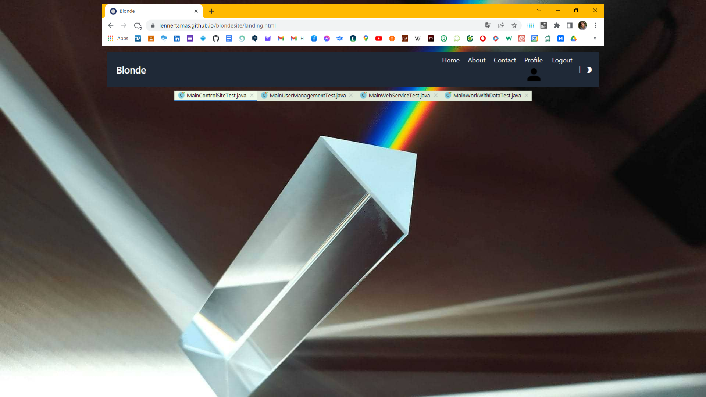

# Documentation for examination papers ('vizsgaremek')

### 7/3/2022 | Codecool's Test Automation course
___
### WEISZ, Dávid | weiszd1119
___
### Mentor's: LENNER, Tamás | MÉSZÁROS, Zsolt
___

<h3 align="center">Automated Blonde Site</h3>

  

     
    <a href="https://lennertamas.github.io/blondesite/">Tested Website</a>
    |
    <a href="https://docs.google.com/spreadsheets/d/1dEiLsYp6zYJDu8JtF6I-paC7DlF53plCgytqlSHMIuQ/edit?usp=sharing">Testmanager File</a>
    |
    <a href="https://github.com/weiszd1119/vizsgaremek-weiszd1119">Code</a>
    |
    <a href="https://weiszd1119.github.io/vizsgaremek-weiszd1119/54/">Allure report</a>
  

  
Table of Contents

  <ol>
    <li><a href="#overview">Overview</a></li>
    <li><a href="#dependencies">Dependencies</a></li>
    <li><a href="#authors">Authors</a></li>
    <li><a href="#allure-report">Allure report</a></li>
    <li><a href="#acknowledgement">Acknowledgment</a></li>
  </ol>

## Overview

* To complete the [Codecool's Test Automation course](https://codecool.com/wp-content/uploads/2022/04/Junior-automata-tesztelo.pdf), this exam paper will test the interface of the web application on [Blondesite](https://lennertamas.github.io/blondesite/) according to the following criteria.
* The table lists the functions and the classes that implement them. The class names are also references to the subpage to be tested.

| Function                                          | Class                                                                                                                                                                                     | Test class                                                     |
|---------------------------------------------------|-------------------------------------------------------------------------------------------------------------------------------------------------------------------------------------------|----------------------------------------------------------------|
| Registration                                      | [Register](https://lennertamas.github.io/blondesite/)                                                                                                                                     | MainUserManagementTest                                         |
| Login                                             | [LoginLogout](https://lennertamas.github.io/blondesite/)                                                                                                                                  | MainUserManagementTest                                         |
| Use of the privacy statement                      | [AcceptContract](https://lennertamas.github.io/blondesite/)                                                                                                                               | MainControlSiteTest                                            |
| List data                                         | [OrderedList](https://lennertamas.github.io/blondesite/post/markdown-syntax/), [Tables]()                                                                                                 | MainWorkWithDataTest                                           |
| Scanning a multi-page list                        | [Pages](https://lennertamas.github.io/blondesite/post/emoji-support/)                                                                                                                     | MainControlSiteTest                                            |
| Entering new data                                 | [Contact](https://lennertamas.github.io/blondesite/contact/), [LoginLogout](https://lennertamas.github.io/blondesite/), [Register](https://lennertamas.github.io/blondesite/), [Search]() | MainControlSiteTest, MainUserManagementTest, MainWorkWithDataTest |
| Repeated and serial data entry from data sources  | [Contact](https://lennertamas.github.io/blondesite/contact/), [LoginLogout](https://lennertamas.github.io/blondesite/), [Register](https://lennertamas.github.io/blondesite/), [Search]() | MainControlSiteTest, MainUserManagementTest, MainWorkWithDataTest |
| Modify existing data                              | [ModifyData](https://lennertamas.github.io/blondesite/)                                                                                                                                   | MainWorkWithDataTest                                           |
| Data(s) deleting                                  | [ModifyData](https://lennertamas.github.io/blondesite/)                                                                                                                                   | MainWorkWithDataTest                                           |
| Save data from the site                           | [SaveImage](https://lennertamas.github.io/blondesite/post/image-test/), [SaveText](https://lennertamas.github.io/blondesite/post/math-typesetting/)                                       | MainWorkWithDataTest                                           |
| Logout                                            | [LoginLogout](https://lennertamas.github.io/blondesite/)                                                                                                                                  | MainUserManagementTest                                         |
| ------------------------------------------------- | -----------------------------------------------                                                                                                                                           | --------------------------------------------------------       |
| Web connection (REST)                             | [WebService](https://lennertamas.github.io/blondesite/)                                                                                                                                   | MainWebServiceTest                                             |
| Page style options (light/dark)                   | [CssStyle](https://lennertamas.github.io/blondesite/about/)                                                                                                                               | MainControlSiteTest                                            |
| Check links to external sites                     | [Links](https://lennertamas.github.io/blondesite/about/)                                                                                                                                  | MainControlSiteTest                                            |
| Checking the operation of tags                    | [Tags](https://lennertamas.github.io/blondesite/about/)                                                                                                                                   | MainControlSiteTest                                            |
| ------------------------------------------------- | ----------------------------------------                                                                                                                                                  | --------------------------------------------------------       |
| Start the browser's driver                        | StartDriver                                                                                                                                                                               | N/A                                                            |
| SiteFactory class (Page Object Modell)            | SiteFactory                                                                                                                                                                               | N/A                                                            |

## Dependencies

* I used IntelliJIdea 2022.1 (Community Edition) to run the tests, the code has written in Java 16.

## Authors

* The test items were created by [WEISZ, Dávid AKA weiszd1119](https://github.com/weiszd1119), participant of the Codecool Test Automation course between 11/04/2022 - 24/06/2022.
* The examination papers and thi documentation is available on [GitHub](https://github.com/weiszd1119/vizsgaremek-weiszd1119).

## Allure report

* Allure report is available at [GitHub Pages](https://weiszd1119.github.io/vizsgaremek-weiszd1119)

## Acknowledgement

Professional and/or emotional support was provided during the preparation of the examination papers:

Mentors of the Codecool's Test Automation course
* Lenner, Tamás
* Mészáros, Zsolt

and its participants:
* Balog, Crisan Roland Florian
* Barta, Erik
* Blastik, Andor
* Börcsök, Bálint István
* Diriczi, Dávid
* Farkas, Zoltán Gyula
* Funák, Attila
* Horváth, János
* Horváth, Klaudia
* Horváth, Zsófia
* Magyar, Gergő
* Morvai, Csaba
* Nagy, Gábor
* Simon, Ágnes
* Simonfi, Péter
* Szarka, Vivien Dorottya
* Tóth, András
* Vas, Petra
 
and participants in the Codecool's Manual Testing course, in particular:
* Katona, Angelika
* László, Katalin

As well as my family and friends who have accompanied me from the beginning:
* Árva, Stefánia Ágnes
* Beitzer, Éva
* Berczi, Berczi
* Busi, László Lajos
* Drüszler, Angela
* Godó, Irén
* Godó, Katalin
* Hajós, Károly
* Hajósné, Weisz Viktória
* Weisz, Anita
* Weisz, Nikoletta
* Weisz, Zoltán
* Weisz-Veréb, Andrea
* Weisz, Anita
* ...And many, others...

___

Weisz, Dávid

Kóka, 3/7/2022

Note: saveTextFromBlondeSite() has already created the file in a previous run, which is why the exported text is listed twice and why we get AssertionError.
